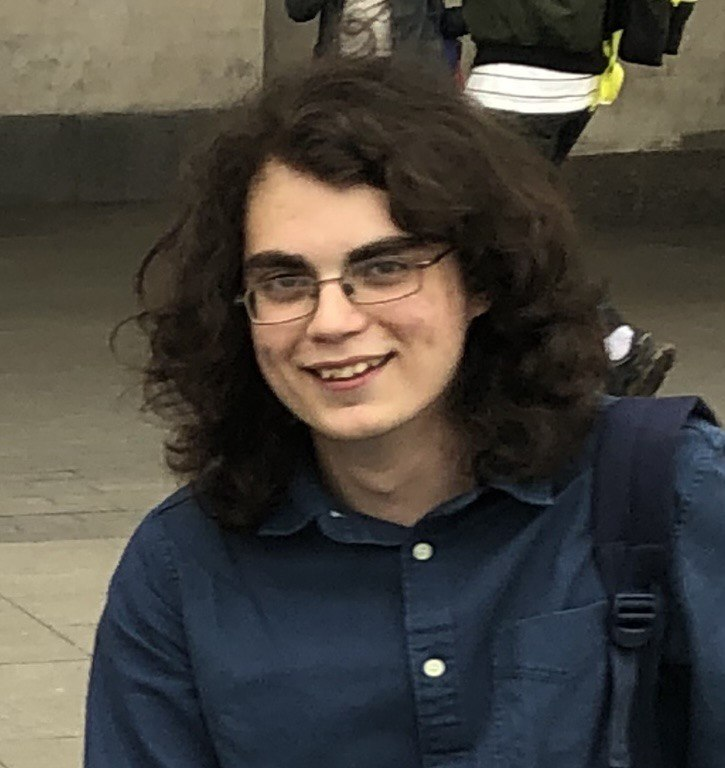
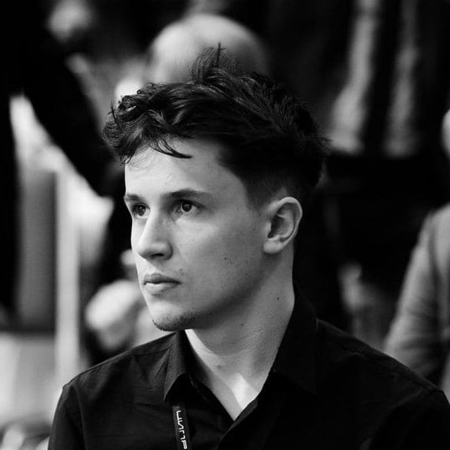
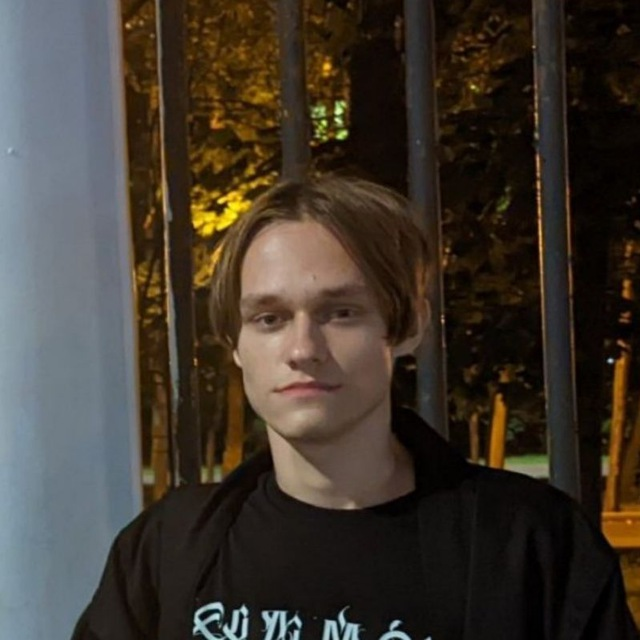
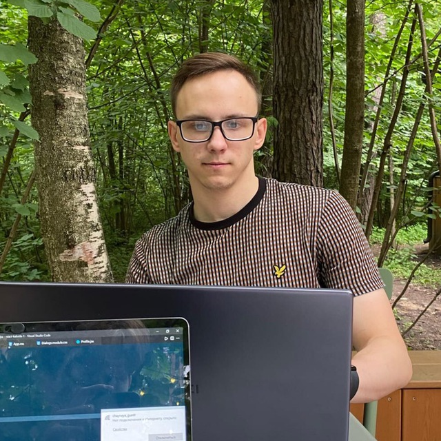

# Введение в машинное обучение 2023
Курс представляет собой изложение основных алгоритмов машинного обучения и методов решения прикладных задач. Курс содержит как теоритический, так и практический материал. 

Каждое занятие состоит из лекции на 90 минут и самостоятельного изучения материала. 

* [🚀 Программа](/docs/program)
* [📧 Чат](https://t.me/+vEZLTQ9wWT44OTRi)
* [📧 Канал](https://t.me/+JuVvTYm2i9pjYjg6)
* [👨‍💻 Github](https://github.com/AI-Knowledge-Club/AI-Knowledge-Club.github.io)

| Иванов Арсений | Калязин Николай | Братчиков Сергей | Новицкий Лев | Стрижаков Даниил | Афанасьев Максим | Волков Даниил |
| ------------ | ------------- | ------------- | ------------- | ------------- | ------------- | ------------- |
|  |  |  |   |   |   |   |
| Researcher   Tg: <https://t.me/arsmathprog>   Tg-канал: <https://t.me/ivarsivars> | Researcher   Tg:  <https://t.me/FanatBoba>  |  University 20.35   Tg:  <https://t.me/hivaze>  | Researcher   Tg:  <https://t.me/leffffffffffff> | Researcher   Tg:  <https://t.me/trifltt> | Researcher   Tg:  <https://t.me/mrapplexz> | Researcher   Tg:  <https://t.me/wolf_Da> |

Октябрь, 2023 г.
